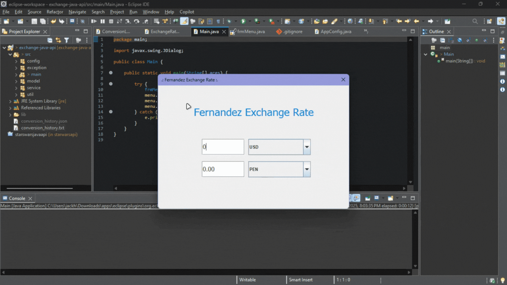

# 💱 Fernandez Exchange Rate

  

Aplicación de escritorio en Java para conversión de divisas en tiempo real utilizando la API de ExchangeRate-API.



## 📋 Tabla de Contenidos

- [Descripción](#-descripción)
- [Características](#-características)
- [Tecnologías Utilizadas](#️-tecnologías-utilizadas)
- [Requisitos Previos](#-requisitos-previos)
- [Obtener API Key](#-obtener-api-key)
- [Instalación](#-instalación)
- [Configuración](#️-configuración)
- [Uso](#-uso)
- [Estructura del Proyecto](#-estructura-del-proyecto)
- [Patrones de Diseño](#-patrones-de-diseño)
- [Historial de Conversiones](#-historial-de-conversiones)
- [Testing con Postman](#-testing-con-postman)
- [Manejo de Errores](#️-manejo-de-errores)
- [Seguridad](#-seguridad)
- [Dependencias](#-dependencias)
- [Contribuciones](#-contribuciones)
- [Licencia](#-licencia)
- [Autor](#-autor)

## 📋 Descripción

**Fernandez Exchange Rate** es una aplicación de escritorio desarrollada en Java con interfaz gráfica Swing que permite realizar conversiones de divisas en tiempo real utilizando la API de ExchangeRate-API. El proyecto implementa patrones de diseño robustos y registra automáticamente cada conversión realizada.

## ✨ Características

- 🌍 Conversión entre múltiples divisas internacionales
- 🔄 Actualización de tasas de cambio en tiempo real
- 💾 Registro automático de conversiones en formato TXT y JSON
- 🕐 Timestamp de cada conversión realizada
- 🎨 Interfaz gráfica intuitiva con Java Swing
- ⚡ Conversión en tiempo real mientras escribes
- 📊 Historial completo de conversiones
- 🛡️ Manejo robusto de excepciones personalizadas
- 🔐 Configuración segura de API Key mediante variables de entorno

## 🛠️ Tecnologías Utilizadas

- **Java 11+** - Lenguaje de programación
- **Java Swing** - Framework para la interfaz gráfica
- **Gson 2.13.2** - Serialización/deserialización JSON
- **Java HttpClient** - Cliente HTTP nativo
- **ExchangeRate-API** - API de tasas de cambio

## 📦 Requisitos Previos

- JDK 11 o superior
- Eclipse IDE (recomendado) o cualquier IDE Java
- Conexión a Internet
- API Key de ExchangeRate-API

## 🔑 Obtener API Key

1. Visita [ExchangeRate-API](https://www.exchangerate-api.com/)
2. Regístrate con tu correo electrónico **(es gratuito)**
3. Accede a tu dashboard y copia tu API Key
4. La versión gratuita ofrece **1,500 peticiones/mes**

## 🚀 Instalación

### 1. Clonar el Repositorio

```bash
git clone https://github.com/jackhfernandez/exchange-java-api.git
cd exchange-java-api
```

### 2. Importar en Eclipse

1. Abre Eclipse
2. `File` → `Import` → `Existing Projects into Workspace`
3. Selecciona el directorio del proyecto
4. Click en `Finish`

### 3. Agregar Gson al ClassPath

#### Opción A: Usar JAR incluido en el proyecto

El proyecto ya incluye `gson-2.13.2.jar` en la carpeta `lib/`:

1. En Eclipse, click derecho en el proyecto
2. `Build Path` → `Configure Build Path`
3. Tab `Libraries` → `Add JARs...`
4. Navega a `lib/gson-2.13.2.jar`
5. Click `Apply and Close`

#### Opción B: Descarga Manual

1. Descarga Gson desde [Maven Central](https://repo1.maven.org/maven2/com/google/code/gson/gson/2.13.2/)
2. Descarga el archivo `gson-2.13.2.jar`
3. Copia el JAR a la carpeta `lib/` del proyecto
4. Sigue los pasos de la Opción A

#### Opción C: Maven (si usas Maven)

Agrega al `pom.xml`:

```xml
<dependency>
    <groupId>com.google.code.gson</groupId>
    <artifactId>gson</artifactId>
    <version>2.13.2</version>
</dependency>
```

#### Opción D: Gradle (si usas Gradle)

Agrega al `build.gradle`:

```gradle
dependencies {
    implementation 'com.google.code.gson:gson:2.13.2'
}
```

## ⚙️ Configuración

### Configurar la API Key

#### Opción 1: Variable de Entorno (Recomendado)

**Windows:**

```cmd
setx EXCHANGE_API_KEY "tu_api_key_aqui"
```

**Nota:** Debes reiniciar la terminal y Eclipse después de configurar la variable.

**Linux/Mac:**

```bash
export EXCHANGE_API_KEY="tu_api_key_aqui"
```

Para hacerlo permanente, agrégalo a tu archivo `.bashrc` o `.zshrc`:

```bash
echo 'export EXCHANGE_API_KEY="tu_api_key_aqui"' >> ~/.bashrc
source ~/.bashrc
```

#### Opción 2: Propiedad del Sistema (VM Arguments)

Configura la API Key en Eclipse:

1. Click derecho en `Main.java` → `Run As` → `Run Configurations...`
2. Selecciona tu configuración
3. Tab `Arguments`
4. En `VM arguments` agrega:

```
-Dexchange.api.key=TU_API_KEY_AQUI
```

5. Click `Apply` y `Run`

#### Opción 3: Variable de Entorno del Sistema (Windows Permanente)

1. Presiona `Win + R`, escribe `sysdm.cpl` y presiona Enter
2. Tab `Opciones avanzadas` → `Variables de entorno`
3. En `Variables de usuario`, click `Nueva`
4. **Nombre:** `EXCHANGE_API_KEY`
5. **Valor:** `tu_api_key_aqui`
6. Click `Aceptar` en todas las ventanas
7. **Reinicia Eclipse**

## 🎯 Uso

### Ejecutar la Aplicación

1. Ejecuta la clase `Main.java`
2. Selecciona la moneda base del combo superior
3. Ingresa el monto a convertir en el campo de texto
4. Selecciona la moneda destino del combo inferior
5. **La conversión se realiza automáticamente en tiempo real**

### Flujo de Trabajo

```
Usuario ingresa monto → Selecciona divisas → Conversión en tiempo real → Registro automático
```

## 📁 Estructura del Proyecto

```
exchange-java-api/
│
├── src/
│   ├── main/
│   │   ├── Main.java              # Punto de entrada de la aplicación
│   │   └── frmMenu.java           # Interfaz gráfica principal (Swing)
│   │
│   ├── config/
│   │   └── AppConfig.java         # Configuración centralizada (API Key, rutas)
│   │
│   ├── service/
│   │   └── ExchangeRateService.java # Comunicación con la API externa
│   │
│   ├── model/
│   │   ├── ExchangeRateResponse.java # Modelo de respuesta de la API
│   │   └── ConversionRecord.java     # Modelo de registro de conversión
│   │
│   ├── util/
│   │   ├── ConversionCalculator.java  # Lógica de cálculo de conversión
│   │   ├── ConversionLogger.java      # Registro en archivos TXT y JSON
│   │   ├── LocalDateTimeAdapter.java  # Adaptador de fechas para Gson
│   │   └── CurrencySelector.java      # Selector de monedas (CLI)
│   │
│   ├── exception/
│   │   ├── ConversionException.java    # Excepciones de conversión
│   │   └── ExchangeRateException.java  # Excepciones de la API
│   │
│   └── assets/
│       └── ExchangeRate.gif       # Demo visual de la aplicación
│
├── lib/
│   └── gson-2.13.2.jar            # Librería Gson incluida
│
├── bin/                            # Archivos compilados (.class)
│
├── conversion_history.txt         # Historial en formato texto
├── conversion_history.json        # Historial en formato JSON
├── .gitignore
└── README.md
```

## 🎨 Patrones de Diseño

### 1. **Service Layer Pattern**

Separa la lógica de negocio de la interfaz de usuario:

- **`ExchangeRateService`**: Gestiona toda la comunicación con la API externa
- **`ConversionCalculator`**: Encapsula los cálculos de conversión
- **`ConversionLogger`**: Maneja la persistencia de datos

```java
// Ejemplo de uso
ExchangeRateService service = new ExchangeRateService(apiKey);
Map<String, Double> rates = service.getAvailableCurrencies("USD");
```

### 2. **Data Transfer Object (DTO)**

Objetos simples para transferir datos entre capas:

- **`ExchangeRateResponse`**: Encapsula la respuesta JSON de la API
- **`ConversionRecord`**: Representa un registro de conversión con todos sus datos

```java
public class ConversionRecord {
    private LocalDateTime timeStamp;
    private String baseCurrency;
    private String targetCurrency;
    private double originalAmount;
    private double convertedAmount;
    private double exchangeRate;
    // Constructor, getters...
}
```

### 3. **Singleton Pattern**

`AppConfig` utiliza métodos estáticos para proporcionar configuración centralizada:

```java
public class AppConfig {
    public static String getApiKey() {
        // Obtiene API key de variable de entorno o propiedad del sistema
        String apiKey = System.getenv("EXCHANGE_API_KEY");
        if (apiKey == null) {
            apiKey = System.getProperty("exchange.api.key");
        }
        return apiKey;
    }
}
```

### 4. **Strategy Pattern**

Múltiples estrategias de persistencia:

```java
public void logConversion(ConversionRecord record) {
    logToTextFile(record);   // Estrategia 1: Formato legible
    logToJsonFile(record);   // Estrategia 2: Formato estructurado
}
```

### 5. **Adapter Pattern**

`LocalDateTimeAdapter` adapta `LocalDateTime` de Java para ser serializado por Gson:

```java
public class LocalDateTimeAdapter implements 
    JsonSerializer<LocalDateTime>, 
    JsonDeserializer<LocalDateTime> {
    
    private static final DateTimeFormatter formatter = 
        DateTimeFormatter.ofPattern("yyyy-MM-dd HH:mm:ss");
    
    @Override
    public JsonElement serialize(LocalDateTime dateTime, Type typeOfSrc, 
                                 JsonSerializationContext context) {
        return new JsonPrimitive(dateTime.format(formatter));
    }
    
    @Override
    public LocalDateTime deserialize(JsonElement json, Type typeOfT, 
                                     JsonDeserializationContext context) {
        return LocalDateTime.parse(json.getAsString(), formatter);
    }
}
```

### 6. **Exception Handling Pattern**

Jerarquía de excepciones personalizadas para diferentes tipos de errores:

```java
public class ConversionException extends Exception {
    public ConversionException(String message) {
        super(message);
    }
    
    public ConversionException(String message, Throwable cause) {
        super(message, cause);
    }
}

public class ExchangeRateException extends Exception {
    public ExchangeRateException(String message) {
        super(message);
    }
    
    public ExchangeRateException(String message, Throwable cause) {
        super(message, cause);
    }
}
```

## 📊 Historial de Conversiones

La aplicación registra **automáticamente** cada conversión en dos formatos diferentes:

### Archivo TXT (`conversion_history.txt`)

Formato legible:

```
[2024-11-23 10:30:45] 100.00 USD -> 389.50 PEN (ExchangeRate: 3.8950)
[2024-11-23 10:31:22] 50.00 EUR -> 191.75 PEN (ExchangeRate: 3.8350)
[2024-11-23 10:32:10] 1000.00 USD -> 3895.00 PEN (ExchangeRate: 3.8950)
[2024-11-23 10:35:45] 200.00 GBP -> 255.00 USD (ExchangeRate: 1.2750)
```

### Archivo JSON (`conversion_history.json`)

Formato estructurado para procesamiento automatizado:

```json
[
  {
    "timeStamp": "2024-11-23 10:30:45",
    "baseCurrency": "USD",
    "targetCurrency": "PEN",
    "originalAmount": 100.0,
    "convertedAmount": 389.5,
    "exchangeRate": 3.895
  },
  {
    "timeStamp": "2024-11-23 10:31:22",
    "baseCurrency": "EUR",
    "targetCurrency": "PEN",
    "originalAmount": 50.0,
    "convertedAmount": 191.75,
    "exchangeRate": 3.835
  },
  {
    "timeStamp": "2024-11-23 10:32:10",
    "baseCurrency": "USD",
    "targetCurrency": "PEN",
    "originalAmount": 1000.0,
    "convertedAmount": 3895.0,
    "exchangeRate": 3.895
  }
]
```

### Información Registrada

Cada conversión guarda los siguientes datos:

- ⏰ **Timestamp**: Fecha y hora exacta de la conversión (`yyyy-MM-dd HH:mm:ss`)
- 💱 **Moneda Base**: Código ISO de la divisa original (ej: USD, EUR, PEN)
- 🎯 **Moneda Destino**: Código ISO de la divisa convertida
- 💵 **Monto Original**: Cantidad ingresada por el usuario
- 💰 **Monto Convertido**: Resultado de la conversión
- 📊 **Tasa de Cambio**: Rate utilizado en la conversión

## 🧪 Testing con Postman

### Endpoint Principal de la API

```
GET https://v6.exchangerate-api.com/v6/{API_KEY}/latest/{BASE_CURRENCY}
```

### Ejemplo de Petición

**Request:**

```
GET https://v6.exchangerate-api.com/v6/TU_API_KEY_AQUI/latest/USD
```

**Headers:**

```
Accept: application/json
```

### Respuesta Esperada

```json
{
  "result": "success",
  "documentation": "https://www.exchangerate-api.com/docs",
  "terms_of_use": "https://www.exchangerate-api.com/terms",
  "time_last_update_unix": 1700092801,
  "time_last_update_utc": "Wed, 15 Nov 2023 00:00:01 +0000",
  "time_next_update_unix": 1700179201,
  "time_next_update_utc": "Thu, 16 Nov 2023 00:00:01 +0000",
  "base_code": "USD",
  "conversion_rates": {
    "USD": 1,
    "AED": 3.6725,
    "AFN": 70.5,
    "ALL": 93.5,
    "AMD": 387.5,
    "ARS": 350.25,
    "AUD": 1.5250,
    "BRL": 4.9150,
    "CAD": 1.3650,
    "EUR": 0.9215,
    "GBP": 0.7920,
    "JPY": 149.50,
    "MXN": 17.2500,
    "PEN": 3.8950
  }
}
```

### Endpoints Disponibles

| Endpoint | Descripción | Ejemplo |
|----------|-------------|---------|
| `/latest/{base}` | Obtiene todas las tasas desde una moneda base | `/latest/USD` |
| `/pair/{from}/{to}` | Obtiene la tasa entre dos monedas específicas | `/pair/USD/PEN` |
| `/enriched/{base}/{amount}` | Conversión enriquecida con metadata adicional | `/enriched/USD/100` |

### Códigos de Respuesta HTTP

| Código | Descripción |
|--------|-------------|
| **200 OK** | Petición exitosa |
| **403 Forbidden** | API Key inválida o no autorizada |
| **404 Not Found** | Moneda no soportada |
| **429 Too Many Requests** | Límite de peticiones excedido (1,500/mes en plan gratuito) |

### Scripts de Prueba en Postman

**1. Verificar código de respuesta:**

```javascript
pm.test("Status code is 200", function () {
    pm.response.to.have.status(200);
});
```

**2. Validar respuesta exitosa:**

```javascript
pm.test("Response is success", function () {
    var jsonData = pm.response.json();
    pm.expect(jsonData.result).to.eql("success");
});
```

**3. Verificar existencia de tasas de conversión:**

```javascript
pm.test("Conversion rates exist", function () {
    var jsonData = pm.response.json();
    pm.expect(jsonData.conversion_rates).to.exist;
    pm.expect(Object.keys(jsonData.conversion_rates).length).to.be.above(100);
});
```

**4. Validar divisa específica (PEN):**

```javascript
pm.test("PEN rate exists and is valid", function () {
    var jsonData = pm.response.json();
    pm.expect(jsonData.conversion_rates.PEN).to.be.a('number');
    pm.expect(jsonData.conversion_rates.PEN).to.be.above(0);
});
```

**5. Verificar moneda base:**

```javascript
pm.test("Base currency is USD", function () {
    var jsonData = pm.response.json();
    pm.expect(jsonData.base_code).to.eql("USD");
});
```

## 🛡️ Manejo de Errores

La aplicación implementa un robusto sistema de manejo de errores:

### Errores de Configuración
- ❌ **API Key no configurada**: Mensaje claro indicando cómo configurarla
- ❌ **API Key inválida**: Detecta respuestas 403 de la API

### Errores de Conexión
- ❌ **Sin conexión a Internet**: Captura excepciones de red
- ❌ **Timeout de la API**: Maneja timeouts gracefully
- ❌ **Errores HTTP** (403, 404, 429): Mensajes específicos por código

### Errores de Validación
- ❌ **Montos negativos**: Validación antes de procesar
- ❌ **Montos no numéricos**: Captura `NumberFormatException`
- ❌ **Campos vacíos**: Validación de inputs obligatorios
- ❌ **Divisas no disponibles**: Verifica existencia en el mapa de tasas

### Errores de Sistema
- ❌ **Errores de I/O**: Al leer/escribir archivos de historial
- ❌ **Errores de serialización**: Al convertir objetos a JSON

### Ejemplo de Validación

```java
private void validateAmount(double amount) throws ConversionException {
    if (amount < 0) {
        throw new ConversionException("El monto no puede ser negativo");
    }
}

private void validateRates(Map<String, Double> rates) throws ConversionException {
    if (rates == null || rates.isEmpty()) {
        throw new ConversionException("Las tasas de conversión no están disponibles");
    }
}
```

## 🔒 Seguridad

### Buenas Prácticas Implementadas

✅ **API Key segura**: Nunca se almacena en el código fuente ni en repositorios

✅ **Variables de entorno**: Configuración sensible mediante variables del sistema

✅ **`.gitignore` configurado**: Excluye archivos sensibles y generados

```gitignore
# Archivos de configuración con claves sensibles
application.properties
config.properties
*.env

# Archivos generados automáticamente
conversion_history.txt
conversion_history.json

# Dependencias locales
lib/

# Archivos compilados
bin/
*.class
```

✅ **Validación de entradas**: Todos los inputs del usuario son validados

✅ **Manejo seguro de excepciones**: No se expone información sensible en los mensajes

✅ **Sin logs sensibles**: No se registra la API Key ni información confidencial

### Recomendaciones de Seguridad

1. **Nunca compartas tu API Key públicamente**
2. **No subas archivos `.env` o de configuración al repositorio**
3. **Rota tu API Key periódicamente**
4. **Usa variables de entorno en producción**
5. **Revisa los commits antes de hacer push**

## 📊 Dependencias

| Biblioteca | Versión | Propósito | Licencia |
|------------|---------|-----------|----------|
| **Gson** | 2.13.2 | Serialización/Deserialización JSON | Apache 2.0 |
| **Java HTTP Client** | JDK 11+ | Cliente HTTP nativo para peticiones a la API | GPL |
| **Swing** | JDK | Framework para interfaz gráfica de usuario | GPL |

### Instalación de Gson

El proyecto incluye `gson-2.13.2.jar` en la carpeta `lib/`. Ver la sección [Agregar Gson al ClassPath](#3-agregar-gson-al-classpath) para instrucciones detalladas de configuración.

## 🤝 Contribuciones

¡Las contribuciones son bienvenidas! Sigue estos pasos:

### Cómo Contribuir

1. **Fork** el repositorio
2. **Clona** tu fork: `git clone https://github.com/tu-usuario/exchange-java-api.git`
3. Crea una **rama** para tu feature: `git checkout -b feature/AmazingFeature`
4. **Commit** tus cambios: `git commit -m 'Add: AmazingFeature'`
5. **Push** a la rama: `git push origin feature/AmazingFeature`
6. Abre un **Pull Request**

### Guías de Contribución

- 📝 Mantén el código limpio y bien documentado
- ✅ Sigue las convenciones de código Java
- 📚 Actualiza la documentación según sea necesario
- 💬 Describe claramente los cambios en el PR

### Ideas para Contribuir

- 🌐 Agregar soporte para más monedas
- 📈 Implementar gráficos de histórico de tasas
- 🎨 Mejorar el diseño de la interfaz
- 🔍 Agregar búsqueda en el historial
- 📱 Crear versión para móvil
- 🧪 Agregar tests unitarios

## 📄 Licencia

Este proyecto es de código abierto y desarrollado en el programa **ALURA ONE**.

Puedes usar, copiar, modificar y distribuir este software libremente, siempre que incluyas y cites al autor.

## 👨‍💻 Autor

**Fernandez**

- 🐙 GitHub: [@jackhfernandez](https://github.com/jackhfernandez)
- 📧 Proyecto: Currency Converter Java Application

## 📞 Soporte

Si encuentras problemas o tienes preguntas:

### Reportar un Bug

1. Ve a la sección de [**Issues**](https://github.com/jackhfernandez/exchange-java-api/issues)
2. Click en **New Issue**
3. Incluye:
   - 🐛 Descripción detallada del problema
   - 🔄 Pasos para reproducir el error
   - 💻 Versión de Java que estás usando
   - 📋 Logs de error (si aplica)
   - 📸 Capturas de pantalla (si es visual)

### Solicitar una Funcionalidad

1. Abre un **Issue** con la etiqueta `enhancement`
2. Describe la funcionalidad propuesta
3. Explica por qué sería útil

### Preguntas Frecuentes (FAQ)

**Q: ¿La API Key es gratuita?**  
A: Sí, ExchangeRate-API ofrece 1,500 peticiones/mes gratis.

**Q: ¿Funciona sin conexión a Internet?**  
A: No, requiere conexión para obtener las tasas actualizadas.

**Q: ¿Puedo usar otra API de tasas de cambio?**  
A: Sí, pero deberás modificar `ExchangeRateService` para adaptarla.

**Q: ¿Dónde se guardan los archivos de historial?**  
A: En la raíz del proyecto (`conversion_history.txt` y `.json`).

## 🙏 Agradecimientos

- 🌐 [ExchangeRate-API](https://www.exchangerate-api.com/) por proporcionar una API gratuita y confiable
- 📦 [Google Gson](https://github.com/google/gson) por la excelente librería de manejo de JSON
- ☕ La comunidad de Java por las herramientas, recursos y soporte continuo
- 💡 Todos los contribuidores que ayudan a mejorar este proyecto

## 🚀 Roadmap Futuro

- [ ] Agregar soporte para conversión por lotes
- [ ] Implementar gráficos históricos de tasas
- [ ] Crear modo oscuro para la interfaz
- [ ] Agregar exportación a Excel/CSV
- [ ] Implementar caché local de tasas
- [ ] Crear API REST propia
- [ ] Agregar tests unitarios y de integración
- [ ] Soporte para criptomonedas

---

⭐ **Si este proyecto te fue útil, considera seguirme y darle una estrella aquí en GitHub!!**

📝 **Última actualización**: 23 Noviembre 2025  
🔖 **Versión**: 1.0.0 
